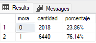
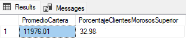
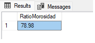
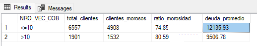
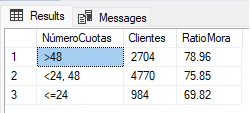
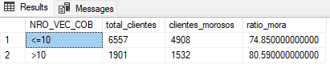
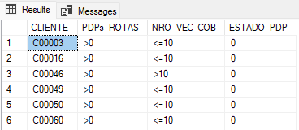
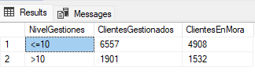
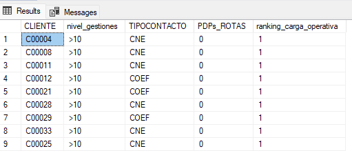
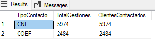

##
# Proyecto SQL: Análisis Integral de Cobranzas en Evaluación de Morosidad y Eficiencia Operativa

<h2>Resumen (Overview)</h2>
El área de cobranzas de la empresa busca mejorar la recuperación de deuda, optimizar la gestión de contactos y reducir los niveles de morosidad. Sin embargo, actualmente no cuenta con una visión clara del comportamiento de pago de los clientes ni de la efectividad de sus estrategias de cobranza.

El objetivo de este proyecto es analizar la información disponible mediante herramientas como SQL Server Management Studio, con el fin de identificar patrones de morosidad, evaluar la eficiencia de las gestiones de cobranza y proponer recomendaciones que permitan mejorar la toma de decisiones y maximizar la recuperación de deuda.


## Estructura del Proyecto

- [Sobre los Datos](#sobre-los-datos)
- [Tareas](#tareas)
- [Limpieza de Datos](#limpieza-de-datos)
- [Análisis Exploratorio de Datos e Insights](#análisis-exploratorio-de-datos-e-insights)

## Sobre los Datos

Los datos originales, junto con la descripción de cada variable, se encuentran disponibles en la fuente correspondiente: [aquí](https://www.kaggle.com/datasets/erickcaychoponce/dataset-contacto-de-cobranza/data)

El conjunto de datos utilizado para este análisis contiene información relacionada con la gestión de cobranzas, incluyendo detalles de deuda, comportamiento de pago, historial de contacto y promesas de pago de los clientes. En total, se cuenta con más de 8,000 registros y múltiples variables , exactamente 16 columnas que permiten analizar la morosidad, la efectividad de las gestiones y el riesgo de incumplimiento.


## Tareas (Task)

En este análisis, ayudo al departamento de Cobranzas a responder lo siguiente:

1. **Nivel de Morosidad:** ¿Cuál es el porcentaje de clientes que se encuentran en situación de mora dentro de la cartera?
Deuda Superior al Promedio: ¿Qué porcentaje de clientes morosos presenta deudas superiores al promedio general de la cartera?
2. **Ratio de Morosidad:** ¿Qué porcentaje del monto total de deuda corresponde a clientes en mora?
3. **Efectividad de Gestiones:** ¿Qué tan efectivas son las gestiones de cobranza según el número de contactos realizados?
4. **Morosidad por Cuotas:** ¿Cómo varía el nivel de morosidad según la cantidad de cuotas del cliente?
5. **Eficiencia Operativa:** ¿Existe relación entre la cantidad de gestiones realizadas y la permanencia de clientes en mora?
6. **Promesas de Pago Incumplidas:** ¿Qué clientes presentan promesas de pago incumplidas y múltiples gestiones de cobranza?
7. **Carga Operativa:** ¿Qué nivel de gestiones concentra la mayor cantidad de clientes morosos?
8. **Ranking de Gestión:** ¿Qué clientes presentan la mayor carga operativa de cobranza según el número de contactos realizados?
9. **Tipos de Contacto:** ¿Cómo se distribuyen las gestiones de cobranza según el tipo de contacto utilizado y qué tan efectivas son?

## Limpieza de Datos

Antes de realizar el análisis, es fundamental asegurar que los datos estén limpios y listos.

#### Valores Nulos o Faltantes

Se realizó una validación de valores nulos en el campo clave CLIENTE, dado su impacto en la integridad del análisis. Tras la revisión, no se detectaron registros con valores faltantes.

```sql
-- Verificar valores faltantes en la tabla CLIENTE --

SELECT CLIENTE AS MISSINGVALUES
FROM TB_COBRANZAS
WHERE CLIENTE IS NULL

```


Posteriormente, se llevó a cabo un análisis para detectar registros duplicados considerando los campos clave del dataset. Esta validación es fundamental para asegurar la calidad de los datos. Tras la revisión, no se encontraron duplicados.

```sql
-- Verificar valores duplicados en la tabla CLIENTE --

SELECT *
FROM
(
SELECT CLIENTE,
      COUNT(1)  OVER (PARTITION BY CLIENTE) AS CUENTA
FROM TB_COBRANZAS
) T
WHERE CUENTA > 1

```

## Análisis Exploratorio de Datos (EDA) e Insights

### Pregunta #1: ¿Cuál es el nivel de morosidad de la cartera y cómo se distribuye entre los clientes?

Para analizar el nivel de morosidad de la cartera, se utilizó una consulta que agrupa a los clientes según su estado de mora (mora) y calcula tanto la cantidad de registros como su porcentaje respecto al total. Para ello, se emplearon las funciones COUNT, GROUP BY y una función de ventana OVER() para obtener el total general.

El resultado del porcentaje fue limitado  a dos decimales para mejorar la claridad y legibilidad de la información. Asimismo, se añadió el símbolo de porcentaje (%) para facilitar su interpretación por parte del usuario final.

```sql
SELECT mora, 
	 COUNT(*) AS cantidad,
	 CONCAT(CAST(100.0 * COUNT(*) / SUM(COUNT(*)) OVER() AS DECIMAL(10,2)),'%') as porcentaje
FROM TB_COBRANZAS
GROUP BY mora;	
```




Los resultados muestran que el 76.14% de los clientes se encuentran en situación de mora, mientras que el 23.86% se mantiene al día en sus pagos. Esto indica una alta concentración de clientes morosos dentro de la cartera, lo que representa un riesgo significativo para la recuperación de deuda.


### Pregunta #2: ¿Qué porcentaje de clientes morosos presenta deudas superiores al promedio general de la cartera?

Esta consulta analiza a los clientes morosos y permite identificar qué porcentaje presenta deudas superiores al promedio general de la cartera morosa. Para ello, se emplearon las funciones AVG y una función de ventana OVER() para calcular el promedio general de deuda y comparar cada cliente respecto a dicho valor.

Asimismo, mediante una estructura CASE, se clasificó a los clientes según si su deuda supera o no el promedio de la cartera. Finalmente, se calculó el porcentaje de clientes con deudas superiores al promedio, permitiendo identificar segmentos de mayor riesgo dentro de la cartera morosa.


```sql

WITH BASE AS (
    SELECT 
        DEUDA_TOTAL,
        CASE
            WHEN DEUDA_TOTAL > AVG(DEUDA_TOTAL) OVER()
            THEN 1
            ELSE 0
        END AS SobrePromedio
    FROM TB_COBRANZAS
    WHERE mora = 1
)
SELECT 
    ROUND(AVG(DEUDA_TOTAL),2) AS PromedioCartera,ROUND(SUM(sobre_promedio) * 100.0 / COUNT(*), 2) AS PorcentajeClientesMorososSuperior
FROM BASE;	
```




<b>Con base en los resultados obtenidos:</b>

- Promedio de deuda de la cartera morosa: S/ 11,976.01
- Porcentaje de clientes con deuda superior al promedio: 32.98%

<b>Se pueden plantear las siguientes recomendaciones para el área de cobranzas:</b>

- Priorizar la gestión de clientes con deuda superior al promedio

- El 32.98% de los clientes concentra deudas mayores al promedio de la cartera morosa, por lo que representan un segmento de mayor riesgo financiero.

<b>Se recomienda:</b>

- Asignar seguimiento prioritario.
- Incrementar la frecuencia de contacto, y aplicar estrategias de recuperación más personalizadas.

### Pregunta #3: ¿Cuál es el ratio de morosidad de la cartera según el monto total de deuda?

<b>El ratio de morosidad es un indicador financiero que mide qué porcentaje del monto total de la cartera corresponde a deuda en situación de mora. Este indicador permite evaluar el nivel de riesgo financiero y la exposición de la empresa frente al incumplimiento de pagos.</b>

El cálculo del ratio de morosidad se realizó mediante las funciones SUM, CASE y ROUND. La consulta permitió identificar el monto total de deuda asociado a clientes morosos y compararlo con el total de deuda de la cartera, obteniendo así el porcentaje de exposición al riesgo financiero. El resultado fue limitado a dos decimales para facilitar su interpretación.

```sql

SELECT 
    ROUND(
        SUM(CASE 
                WHEN mora = 1 
                THEN DEUDA_TOTAL 
                ELSE 0 
            END) 
        * 100.0 / 
        SUM(DEUDA_TOTAL),
    2) AS RatioMorosidad

FROM TB_COBRANZAS;
```




El análisis muestra que el ratio de morosidad de la cartera es de 78.98%, lo que significa que aproximadamente el 79% del monto total de deuda corresponde a clientes en situación de mora.

Este resultado evidencia una alta concentración de deuda vencida dentro de la cartera, representando un nivel elevado de riesgo financiero para la empresa y una posible afectación en la recuperación de ingresos.

Asimismo, el indicador sugiere la necesidad de fortalecer las estrategias de cobranza y priorizar la gestión de clientes con mayores montos adeudados para reducir la exposición al incumplimiento de pagos.

<b>Se recomienda:</b>

- Priorizar la recuperación de deuda de clientes morosos con altos montos pendientes.
- Implementar campañas preventivas para evitar el crecimiento de la cartera vencida.
- Realizar seguimiento continuo del ratio de morosidad como indicador clave de riesgo financiero.
- Aplicar segmentación de clientes según nivel de deuda y probabilidad de incumplimiento.


### Pregunta #4: ¿Qué tan efectivas son las gestiones de cobranza según el número de contactos realizados?


Para evaluar la eficiencia operativa del proceso de cobranza, se analizó la relación entre la cantidad de contactos realizados a los clientes y el nivel de morosidad registrado.

El objetivo es determinar si un mayor número de gestiones de cobranza contribuye efectivamente a reducir el incumplimiento de pagos o si, por el contrario, existe una sobre gestión operativa en determinados segmentos de clientes.

La consulta agrupa a los clientes según el número de intentos de cobranza (NRO_VEC_COB) y calcula:

- total de clientes,
- cantidad de clientes morosos,
- ratio de morosidad,
- deuda promedio por grupo.

```sql
SELECT
    NRO_VEC_COB,
    COUNT(*) AS total_clientes,
    SUM(MORA) AS clientes_morosos,
    
    ROUND(
        SUM(MORA) * 100.0 / COUNT(*),
    2) AS ratio_morosidad,

    ROUND(AVG(DEUDA_TOTAL),2) AS deuda_promedio

FROM TB_COBRANZAS
GROUP BY NRO_VEC_COB
ORDER BY NRO_VEC_COB;
```



Los resultados muestran que los clientes con más de 10 intentos de cobranza presentan un ratio de morosidad de 80.59%, superior al grupo con hasta 10 gestiones (74.85%).

Esto evidencia que incrementar la cantidad de contactos no garantiza una reducción de la mora y podría reflejar una baja efectividad operativa en ciertos segmentos de clientes.

Además, el grupo con mayor cantidad de gestiones presenta una deuda promedio menor, lo que sugiere una posible sobre utilización de recursos operativos en clientes de bajo valor financiero.

<b>Se recomienda:</b>
- Priorizar clientes con mayor monto adeudado.
- Optimizar la frecuencia de contacto.
- Implementar segmentación por riesgo.
- Diseñar estrategias diferenciadas para clientes reincidentes.

### Pregunta #5: ¿Cómo varía la morosidad según la cantidad de cuotas del cliente?

La consulta evalúa la relación entre el número de cuotas asociadas al cliente (NRO_CUOTAS) y el nivel de morosidad registrado.

Para ello:

- Agrupa a los clientes por rango de cuotas, calcula la cantidad de clientes por grupo,y obtiene el ratio de morosidad promedio.
- El objetivo es identificar si los clientes con mayores niveles de financiamiento presentan un mayor riesgo de incumplimiento.

```sql
SELECT
    NRO_CUOTAS,
    COUNT(*) AS clientes,
    ROUND(AVG(CAST(MORA AS FLOAT))*100,2) AS ratio_mora
FROM TB_COBRANZAS
GROUP BY NRO_CUOTAS
ORDER BY ratio_mora DESC;
```


Los resultados evidencian que los clientes con mayores plazos de financiamiento presentan niveles más elevados de morosidad.

Esto sugiere que un mayor número de cuotas podría incrementar el riesgo de incumplimiento, posiblemente debido a:

- mayor carga financiera,
- sobreendeudamiento,
- deterioro de capacidad de pago, o menor compromiso de pago en obligaciones de largo plazo.

Asimismo, los clientes con menores cantidades de cuotas muestran un comportamiento de pago más estable y menor exposición al riesgo crediticio.

<b>Se recomienda:</b>

- fortalecer la evaluación crediticia en financiamientos de largo plazo,
- aplicar estrategias preventivas para clientes con alto número de cuotas,
- implementar monitoreo temprano en segmentos de mayor riesgo,
- y priorizar campañas de cobranza preventiva en clientes altamente financiados.


### Pregunta #6: ¿Qué tan eficiente es la gestión operativa de cobranza según el número de contactos realizados?

Analicé qué tan eficiente es la gestión operativa de cobranza según el número de contactos realizados utilizando las funciones COUNT, SUM, CASE, ROUND y GROUP BY.

Primero agrupé los clientes según la cantidad de gestiones de cobranza realizadas (NRO_VEC_COB). Luego calculé el total de clientes y la cantidad de clientes morosos mediante una suma condicional con CASE WHEN MORA = 1.

Finalmente, obtuve el ratio de morosidad dividiendo la cantidad de clientes morosos entre el total de clientes de cada grupo y multiplicándolo por 100 para expresar el resultado en porcentaje, redondeándolo a 2 decimales para facilitar el análisis.

Con este análisis pude evaluar si una mayor cantidad de contactos de cobranza contribuye realmente a reducir la morosidad o si existen clientes que continúan en mora pese a múltiples gestiones realizadas.

```sql
SELECT
    NRO_VEC_COB,
    COUNT(*) AS total_clientes,
    SUM(
        CASE
            WHEN MORA = 1 THEN 1
            ELSE 0
        END
    ) AS clientes_morosos,
    ROUND(
        SUM(
            CASE
                WHEN MORA = 1 THEN 1
                ELSE 0
            END
        ) * 100.0 / COUNT(*),
    2) AS ratio_mora
FROM TB_COBRANZAS
GROUP BY NRO_VEC_COB;
```


Se analizó la eficiencia operativa de cobranza según el número de contactos realizados a los clientes.

Los resultados muestran que los clientes con más de 10 gestiones presentan un ratio de morosidad de 80.59%, superior al grupo con 10 o menos contactos (74.85%).

Esto evidencia que un mayor número de intentos de cobranza no necesariamente reduce la morosidad, lo que podría indicar:

- Existencia de clientes de alta reincidencia,
- Baja efectividad en ciertas estrategias de cobranza,
- o necesidad de segmentar mejor las acciones según el perfil de riesgo del cliente.

<b>Se recomienda:</b>

- Implementar estrategias de cobranza segmentadas según el nivel de riesgo y comportamiento histórico del cliente, priorizando acciones diferenciadas para clientes reincidentes o de difícil recuperación.
- Evaluar la calidad y efectividad de las gestiones realizadas, ya que un mayor número de contactos no está generando una reducción significativa de la morosidad.
- Fortalecer las acciones preventivas antes de que el cliente acumule demasiadas gestiones, mediante recordatorios tempranos, seguimiento oportuno y comunicación personalizada.
- Analizar qué canales de contacto generan mejores resultados (llamadas, WhatsApp, correo, etc.) para optimizar recursos y mejorar la tasa de recuperación.


### Pregunta #7: ¿Qué clientes presentan promesas de pago incumplidas y múltiples gestiones de cobranza?

Analicé qué clientes presentan promesas de pago incumplidas y múltiples gestiones de cobranza utilizando las cláusulas SELECT y WHERE.

Se utilizaron las columnas CLIENTE, PDPs_ROTAS, NRO_VEC_COB y ESTADO_PDP de la tabla TB_COBRANZAS, con el objetivo de identificar a los clientes que incumplieron compromisos de pago y revisar cuántas gestiones de cobranza recibieron.

Luego se filtro:

```sql
WHERE PDPs_ROTAS = '>0'
```
para mostrar únicamente a los clientes que registran al menos una promesa de pago incumplida.

Con este análisis pude identificar clientes con alto riesgo de reincidencia, ya que presentan compromisos de pago no cumplidos pese a haber recibido múltiples contactos de cobranza, lo que permite evaluar la efectividad de las gestiones realizadas y detectar posibles casos de difícil recuperación.

```sql
SELECT
    CLIENTE,
    PDPs_ROTAS,
    NRO_VEC_COB,
    ESTADO_PDP
FROM TB_COBRANZAS
WHERE PDPs_ROTAS = '>0';
```



El resultado muestra una lista de clientes que registran promesas de pago incumplidas (PDPs_ROTAS > 0) junto con la cantidad de gestiones de cobranza realizadas (NRO_VEC_COB) y el estado de la promesa de pago (ESTADO_PDP).

Se observa que varios clientes presentan:

- promesas de pago rotas,
- múltiples intentos de cobranza, y un estado de compromiso no cumplido (ESTADO_PDP = 0).

Además, algunos clientes recibieron más de 10 contactos de cobranza (>10) y aun así continúan incumpliendo sus compromisos, lo que evidencia posibles casos de clientes reincidentes o de difícil recuperación.

Este comportamiento sugiere que la cantidad de gestiones realizadas no siempre garantiza el cumplimiento de pago y que podrían existir limitaciones en la efectividad de las estrategias de cobranza actuales.

<b>Se recomienda:</b>

- Implementar segmentación de clientes según historial de incumplimientos para aplicar estrategias de cobranza diferenciadas.
- Priorizar acciones preventivas y negociaciones tempranas antes de que los clientes acumulen múltiples promesas rotas.
- Evaluar la efectividad de las gestiones realizadas, ya que el aumento de contactos no necesariamente está generando cumplimiento de pago.

### Pregunta #8: ¿Qué tan eficiente es la gestión operativa de cobranza según el número de contactos realizados?

Analicé qué tan eficiente es la gestión operativa de cobranza según el número de contactos realizados utilizando las funciones COUNT, SUM, CASE, GROUP BY y ORDER BY.

Primero agrupé los registros según la cantidad de gestiones de cobranza realizadas (NRO_VEC_COB). Luego calculé el total de clientes gestionados y la cantidad de clientes que permanecen en mora mediante una suma condicional con CASE WHEN MORA = 1.

Finalmente, ordené los resultados de mayor a menor cantidad de clientes en mora para identificar qué nivel de gestión concentra más casos de incumplimiento.

```sql
SELECT
    NRO_VEC_COB AS NivelGestiones,
    COUNT(*) AS ClientesGestionados,
    SUM(
        CASE
            WHEN MORA = 1 THEN 1
            ELSE 0
        END
    ) AS ClientesEnMora
FROM TB_COBRANZAS
GROUP BY NRO_VEC_COB
ORDER BY ClientesEnMora DESC;
```


Los resultados muestran que:

Los clientes con hasta 10 gestiones representan la mayor cantidad de casos gestionados (6557 clientes), de los cuales 4908 permanecen en mora. Los clientes con más de 10 contactos (1901 clientes) también mantienen una alta cantidad de morosidad (1532 clientes).

Esto evidencia que incrementar el número de contactos no necesariamente garantiza la recuperación de deuda, ya que incluso después de múltiples gestiones muchos clientes continúan en mora.

<b>Se recomienda:</b>

- Implementar estrategias de cobranza segmentadas según el perfil y comportamiento del cliente.
- Priorizar acciones preventivas antes de que el cliente acumule demasiadas gestiones.
- Evaluar la efectividad de los canales y tipos de contacto utilizados.
- Identificar clientes reincidentes para aplicar estrategias especiales de recuperación.
- Medir indicadores de eficiencia operativa para optimizar recursos y mejorar la recuperación de deuda.

### Pregunta #9: ¿Cómo se distribuye la carga operativa de cobranza según el nivel de gestiones realizadas?

Analicé cómo se distribuye la carga operativa de cobranza según el nivel de gestiones realizadas utilizando las columnas CLIENTE, NRO_VEC_COB, TIPOCONTACTO, PDPs_ROTAS y la función de ventana RANK().

Se utilizó la información de cada cliente junto con el nivel de gestiones realizadas (NRO_VEC_COB), el tipo de contacto utilizado (TIPOCONTACTO) y las promesas de pago incumplidas (PDPs_ROTAS).

Luego utilicé la función:
```sql
RANK() OVER(ORDER BY NRO_VEC_COB DESC)
```
para generar un ranking de carga operativa, asignando mayor prioridad a los clientes con más gestiones de cobranza realizadas.

Los resultados muestran que varios clientes con más de 10 contactos (>10) presentan el ranking más alto de carga operativa (ranking_carga_operativa = 1), lo que indica que concentran una mayor cantidad de esfuerzo de cobranza.

```sql
SELECT
    CLIENTE,
    NRO_VEC_COB AS nivel_gestiones,
    TIPOCONTACTO,
    PDPs_ROTAS,
    RANK() OVER(
        ORDER BY NRO_VEC_COB DESC
    ) AS ranking_carga_operativa
FROM TB_COBRANZAS;
```


Los resultados muestran que varios clientes con más de 10 contactos (>10) presentan el ranking más alto de carga operativa (ranking_carga_operativa = 1), lo que indica que concentran una mayor cantidad de esfuerzo de cobranza.

Además, se observa que algunos de estos clientes también presentan promesas de pago incumplidas (PDPs_ROTAS > 0), evidenciando posibles casos de clientes reincidentes o de difícil recuperación.

<b>Se recomienda:</b>

- Priorizar estrategias diferenciadas para clientes con alta carga operativa y reincidencia.
- Evaluar la rentabilidad de continuar realizando múltiples gestiones sobre clientes con baja probabilidad de recuperación.
- Optimizar los canales de contacto más efectivos para reducir esfuerzo operativo.
- Implementar segmentación por riesgo y comportamiento de pago para asignar mejor los recursos de cobranza.
- Monitorear clientes con promesas rotas y alta cantidad de contactos para aplicar estrategias especiales de negociación o refinanciamiento.

### Pregunta #10: ¿Cómo se distribuye la carga operativa de cobranza según el tipo de contacto utilizado?

Analicé la distribución de las gestiones de cobranza según el tipo de contacto realizado utilizando las funciones COUNT, DISTINCT, GROUP BY y ORDER BY.

Se agrupo los registros según el tipo de contacto (TIPOCONTACTO). Luego se calculo el total de gestiones realizadas y la cantidad de clientes contactados mediante COUNT(*) y COUNT(DISTINCT CLIENTE).

Finalmente, se ordeno los resultados de mayor a menor número de gestiones para identificar qué tipo de contacto presenta mayor participación dentro del proceso de cobranza y evaluar la efectividad de las gestiones realizadas.

```sql
SELECT
    TIPOCONTACTO as TipoContacto,
    COUNT(*) AS TotalGestiones,
    COUNT(DISTINCT CLIENTE) AS ClientesContactados
FROM TB_COBRANZAS
GROUP BY TIPOCONTACTO
ORDER BY TotalGestiones DESC;
```


La consulta muestra que el tipo de contacto CNE(Contacto No Efectivo) registra 5974 gestiones, mientras que COEF(Contacto Efectivo) tiene 2484. Esto indica que la mayoría de las gestiones de cobranza fueron no efectivas, ya que predominan ampliamente los contactos CNE sobre los efectivos.

Además, el número de gestiones coincide con la cantidad de clientes contactados, lo que sugiere que cada cliente fue registrado una sola vez dentro de cada tipo de contacto. Esto podría indicar una base consolidada o pocos intentos de gestión por cliente.

En términos operativos, el predominio de contactos no efectivos evidencia una baja efectividad en el proceso de cobranza, lo que puede afectar la recuperación de deuda y reflejar dificultades para localizar o comunicarse con los clientes.

<b>Se recomienda:</b>

- Actualizar y validar periódicamente los datos de contacto de los clientes para reducir la cantidad de gestiones no efectivas.
- Evaluar los horarios y días en los que se realizan las llamadas, identificando los momentos con mayor probabilidad de contacto efectivo.
- Monitorear indicadores de efectividad de cobranza, como porcentaje de contactos efectivos y tasa de recuperación, para medir el desempeño del área.
- Capacitar a los gestores de cobranza en técnicas de comunicación y negociación para mejorar la efectividad de las interacciones con los cliente