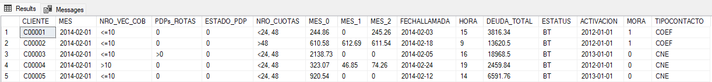

##
# Proyecto SQL: Análisis Integral de Cobranzas en Evaluación de Morosidad y Eficiencia Operativa

<h2>Resumen (Overview)</h2>
El área de cobranzas de la empresa busca mejorar la recuperación de deuda, optimizar la gestión de contactos y reducir los niveles de morosidad. Sin embargo, actualmente no cuenta con una visión clara del comportamiento de pago de los clientes ni de la efectividad de sus estrategias de cobranza.

El objetivo de este proyecto es analizar la información disponible mediante herramientas como SQL Server Management Studio, con el fin de identificar patrones de morosidad, evaluar la eficiencia de las gestiones de cobranza y proponer recomendaciones que permitan mejorar la toma de decisiones y maximizar la recuperación de deuda.


## Estructura del Proyecto

<ul>
<li><a href="#sobre-los-datos">Sobre los Datos</a></li>
<li><a  href="#Tareas">Tareas</a></li>
<li><a  href="#limpieza-de-datos">Limpieza de Datos</a></li>
<li><a  href="#análisis-exploratorio-de-datos-e-insights">Análisis Exploratorio de Datos e Insights.</a></li>
</ul>

## Sobre los Datos

Los datos originales, junto con la descripción de cada variable, se encuentran disponibles en la fuente correspondiente: [aquí](https://www.kaggle.com/datasets/erickcaychoponce/dataset-contacto-de-cobranza/data)

El conjunto de datos utilizado para este análisis contiene información relacionada con la gestión de cobranzas, incluyendo detalles de deuda, comportamiento de pago, historial de contacto y promesas de pago de los clientes. En total, se cuenta con más de 8,000 registros y múltiples variables , exactamente 16 columnas que permiten analizar la morosidad, la efectividad de las gestiones y el riesgo de incumplimiento.




## Tareas (Task)

En este análisis, apoyo al departamento de Cobranzas a responder lo siguiente:

1. **Antigüedad:** ¿Cuál es el promedio de antigüedad de los empleados en cada departamento?

## Limpieza de Datos

Antes de realizar el análisis, es fundamental asegurar que los datos estén limpios y listos.

#### Valores Nulos o Faltantes

Primero, se revisó la existencia de valores faltantes en los dos campos clave: `CLIENTE`. No se encontraron valores nulos.

```sql
-- Verificar valores faltantes en la tabla CLIENTE --

SELECT CLIENTE AS MISSINGVALUES
FROM TB_COBRANZAS
WHERE CLIENTE IS NULL


A continuación, es vital asegurarse de que se eliminen las filas duplicadas, en caso de encontrarse, nuevamente en los campos clave. No se encontraron duplicados.

```sql
-- Verificar valores duplicados en la tabla CLIENTE --

SELECT *
FROM
(
SELECT CLIENTE,
      COUNT(1)  OVER (PARTITION BY CLIENTE) AS CUENTA
FROM TB_COBRANZAS
) T
WHERE CUENTA > 1


